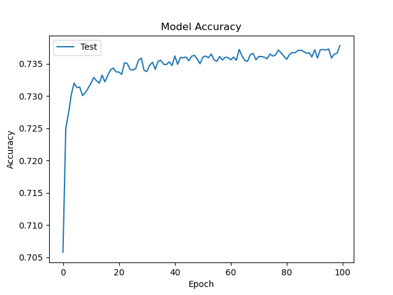
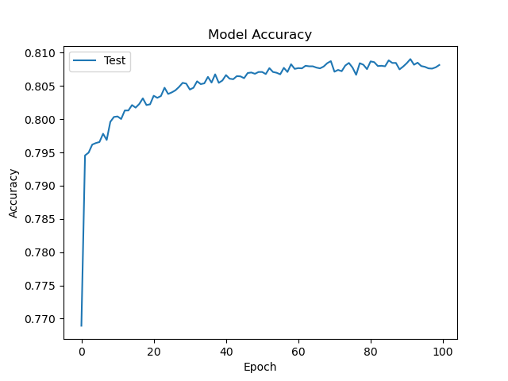

# deep-learning-challenge

PREDICTIVE MODELING FOR NONPROFIT FUNDING SUCCESS: A DEEP LEARNING APPROACH

Overview

This analysis aims to develop an advanced predictive tool for the nonprofit foundation Alphabet Soup. Leveraging machine learning and neural networks, the predictive tool will serve as a binary classifier, enabling Alphabet Soup to identify applicants with the highest likelihood of success in their ventures.
Process
A CSV file containing data on more than 34,000 funded organizations was utilized. Preprocessing involved selecting relevant columns, consolidating rare categorical values, and converting categorical data into numerical format using Pandas. The dataset was split into training and testing subsets, and StandardScaler was applied to normalize the data.

Preprocessing

 I preprocessed the data by:
 • dropping non-beneficial variables,that is EIN and NAME.
 • finding the number of data points for each unique value for each of the columns that had more than 10 unique values - APPLICATION_TYPE and CLASSIFICATION, 
• choosing a cutoff point of 600 and 300, respectively, to bin rare categorical values together into a new value called "Other",
 • using `pd.get_dummies()` to convert categorical data to numeric.
• dividing the data into a target array (IS_SUCCESSFUL) and features arrays (APPLICATION_TYPE,AFFLIATION,CLASSIFICATION,USE_CASE,ORGANIZATION,STATUS,INCOME_AMT,SPECIAL_CONSIDERATIONS and ASK_AMT)
 • applying the `train_test_split` to create a testing and a training dataset.
 • and finally, using `StandardScaler` to scale the training and testing sets. The resulting data included 44 features. The target variable (y) was IS_SUCCESSFUL. The data was split into training and test subsets.
Compiling, Training and Evaluating the Model
 The model was required to achieve a target predictive accuracy higher than 75%. I made two official attempts using machine learning and neural networks. The first attempt resulted in an accuracy rate of about 73%, a little short of the required target accuracy. The second attempt resulted in an accuracy rate of about 79% which is over the minimum required target accuracy 75%. Results from each model attempt are detailed below: 

Attempt #1 

The first attempt (Resources/AlphabetSoupCharity.h5) resulted in an accuracy score of 72.5%. The hyperparameters used were:
•	layers = 2 
o	layer1 = 9 neurons and ‘relu’ activation function
o	layer2 = 18 neurons and ‘relu’ activation function
•	Epochs = 100

 

Attempt #2

The second attempt (Resources/AlphabetSoupCharity_Optimisation.h5) resulted in an accuracy score of 79%. The hyperparameters used were:
•	layers = 3 
o	layer1 = 50 neurons and ‘relu’ activation function.
o	layer2 = 20 neurons and ‘sigmoid’ activation function.
o	layer3 =10 neurons and 'sigmoid' activation function.
•	Epochs = 100
 
 

In the two official attempts made, I was able to achieve the target model performance. The model performance was increased due to the following steps:
•	I added a third layer with sigmoid as activation function.
•	I changed the activation function from relu to sigmoid on the second layer.
•	Added more neurons on all the layers.
•	Instead of dropping both EIN AND NAME variables, I dropped EIN only and included NAME in the new model.

Summary

The model in the second attempt surpassed the target performance, so it's advisable to use it. This was achieved by optimizing the model differently: instead of dropping all identification variables (EIN & NAME), NAME was retained. Dropping all of them led to a significant loss of information, which decreased accuracy.

    

